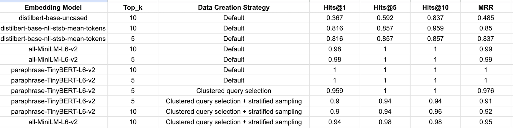

# Grainger ML Interview

This repository contains a solution for Grainger ML Engineer take-home interview assignment.

This code explores how different embedding models and data sampling strategies affect retrieval performance in a query-to-product matching task. I benchmarked models using common metrics like Hits@K and MRR to understand generalization and overfitting tendencies.

---

## Project Structure

- `data.py`  
  Generates the evaluation dataset by sampling query-product pairs. Includes:
  - **Default Random Sampling**: Randomly selects 50 queries and 500 random products against those.
  - **Clustered Query Selection**: Queries are grouped into 10 clusters. 5 queries are selected from each cluster making it 50 queries. and then 500 products are randomly selected against those.
  - **Clustered Query Selection + Stratified Sampling**:Queries are grouped into 10 clusters. 5 queries are selected from each cluster making it 50 queries then stratified sampling is used to ensure a balanced representation of each cluster for the final 500 product samples.

- `main.py`  
  Builds a FAISS index on the product embeddings and evaluates retrieval using:
  - Hits@1 / Hits@5 / Hits@10
  - Mean Reciprocal Rank (MRR)

---

## Embedding Model Comparison

I benchmarked multiple models using different data creation strategies. Below is a visual summary:



---

## 🧪 How to Run

1. **Generate Dataset**
   ```bash
   python data.py

2. **Build Index & Evaluate** 

```bash
   python main.py
